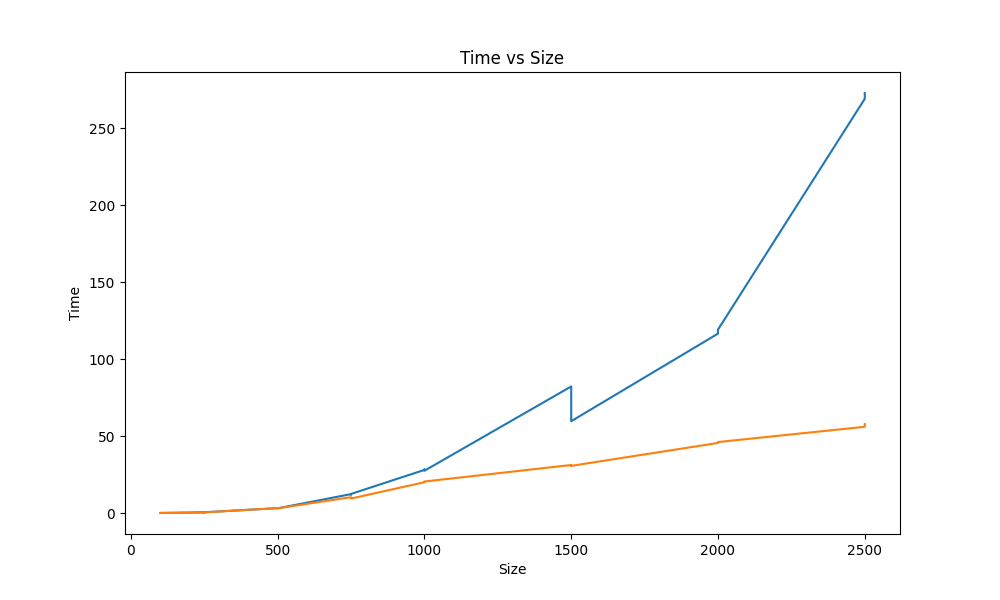

# Лабораторая работа №2

## Задание: 
1. Модифицировать программу из л/р №1 для параллельной работы по технологии OpenMP

## Характеристики ЭВМ
1. 
2. 
3. 

#### Компилятор - msys64
#### IDE - VS code

## Результаты: 
1. сгенерированны матрицы в `matrix1_2` разных размеров
2. результат перемножение матриц в `matrix_3`
3. файл статистики: `result.txt`
4. файл проверки совпадения матриц: `result_py.txt`

### График 
В результате проведения лабораторной работы была построена следующая зависимость времени выполнения от количества элементов 

[Ссылка на файл с данными](file/result.txt)

## Выводы
OpenMP позволил ускорить исследуемую операцию. Каждый поток работает над своей частью результирующей матрицы, что позволяет эффективнее использовать вычислительные ресурсы и уменьшить время выполнения операции умножения.
