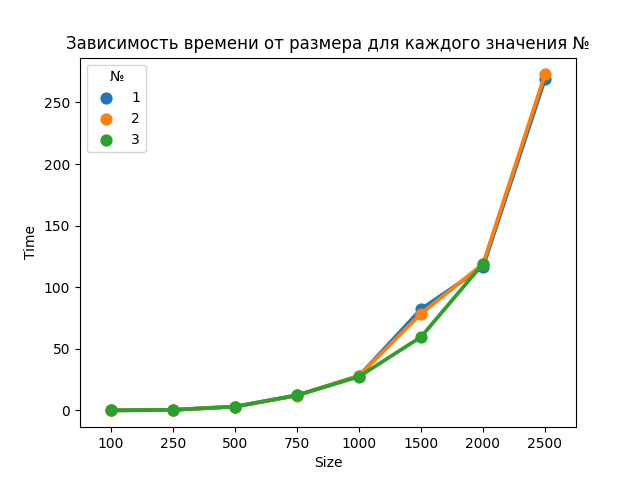

# Лабораторая работа №1 

## Задание: 
1. Написать программу на языке C/C++ для перемножения двух матриц. 
2. Исходные данные: файл(ы) содержащие значения исходных матриц.
3. Выходные данные: файл со значениями результирующей матрицы, время выполнения, объем задачи.
    Обязательна автоматизированная верификация результатов вычислений с помощью сторонних библиотек или стороннего ПО.

## Характеристики ЭВМ
1. Процессор - 12th Gen Intel(R) Core(TM) i3-1215U   2.50 GHz
2. Оперативная память - 16 ГБ
3. Графика - Intel UHD Graphics
4. Windows 11 Home

#### Компилятор - msys64
#### IDE - VS code

## Результаты: 
1. сгенерированны матрицы в `matrix1_2` разных размеров
2. результат перемножение матриц в `matrix_3`
3. файл статистики: `result.txt`
4. файл проверки совпадения матриц: `result_py.txt`

### График 
В результате проведения лабораторной работы была построена следующая зависимость времени выполнения от количества элементов 

[Ссылка на файл с данными](file/result.txt)

## Выводы
При последовательном выполнении подсчета произведения двух матриц, время увеличивается с экспоненциальной зависимостью от количества элементов

